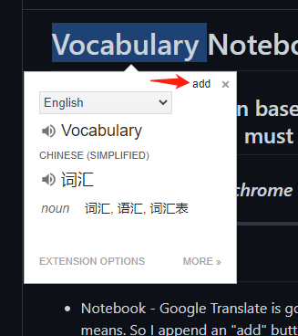
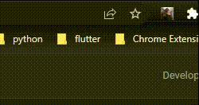
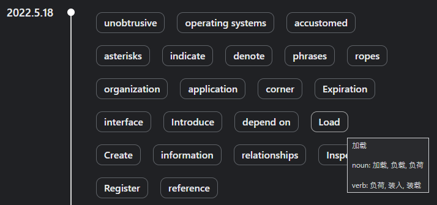

# Vocabulary Notebook

## A chrome extension based on Google Translate that can help me to improve my English. So you must install Google Translate first.

### _It's just an attempt at chrome extension_ 😉

---

## Features

-   Notebook - Google Translate is good enough. But it can not record some vocabularies which I don't know their means. So I append an "add" button on Google Translate's bubble to help me record this vocab into the notebook. And then you can review your vocabulary anytime.  
    

-   Timeline - Vocabularies are split by date on the notebook.  
      
    

It has met my needs now. Maybe I will refactor it with React or Vue in my free time. And many new features or something cool. 😆
